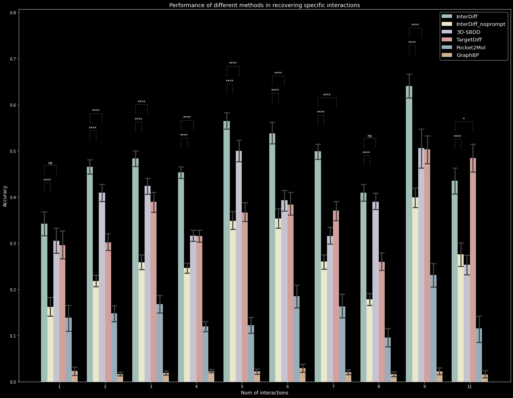

# Guided Diffusion for Molecule Generation with Interaction Embedding

[](https://github.com/guanjq/targetdiff/blob/main/LICIENCE)

## Results
1. Sampled molecules _sdf_ files from 3D-SBDD, GaphBP, Pocket2Mol, TargetDiff and our InterDiff are released in _Zenodo_, you can get the data [here](https://zenodo.org/records/10205723).

2. The project code has also been deployed to [*Google Drive*](https://drive.google.com/drive/folders/1P1sedbWrQ_xQcYR9X0V0zxbZYNgAAzM_) and *Google Collab*, and you can directly run the test code through the [interdiff.ipynb](https://drive.google.com/file/d/1ia_CouDu4dDOTw6--wirviF1XkoH4arj/view?usp=drive_link) file.

   

   

## Python Environment Install
Please use [_Mamba_](https://mamba.readthedocs.io/en/latest/micromamba-installation.html) to manage the environment.
```bash
micromamba create -n interdiff python=3.8 -y
micromamba activate interdiff
micromamba install pytorch==1.13.1 torchvision==0.14.1 torchaudio==0.13.1 pytorch-cuda=11.6 -c pytorch -c nvidia

### url: https://pytorch-geometric.com/whl/torch-1.13.1%2Bcu116.html
### SYSTEM_TYPE: win_amd64/linux_x86_64
export SYSTEM_TYPE=linux_x86_64
### We provide the *.whl for torch_geometric in _env.
pip install _env/$SYSTEM_TYPE/torch_scatter-2.1.1+pt113cu116-cp38-cp38-linux_x86_64.whl -i https://pypi.tuna.tsinghua.edu.cn/simple some-package
pip install _env/$SYSTEM_TYPE/torch_cluster-1.6.1+pt113cu116-cp38-cp38-linux_x86_64.whl -i https://pypi.tuna.tsinghua.edu.cn/simple some-package
pip install _env/$SYSTEM_TYPE/torch_sparse-0.6.17+pt113cu116-cp38-cp38-linux_x86_64.whl -i https://pypi.tuna.tsinghua.edu.cn/simple some-package
pip install _env/$SYSTEM_TYPE/torch_spline_conv-1.2.2+pt113cu116-cp38-cp38-linux_x86_64.whl -i https://pypi.tuna.tsinghua.edu.cn/simple some-package
pip install torch_geometric -i https://pypi.tuna.tsinghua.edu.cn/simple some-package

micromamba install rdkit=2022.03 openbabel tensorboard pyyaml easydict python-lmdb -c conda-forge
pip install meeko==0.1.dev3 scipy pdb2pqr vina==1.2.2 transformers
python -m pip install git+https://github.com/Valdes-Tresanco-MS/AutoDockTools_py3
```

## Data Preprocess
We provide the preprocessed data on [data](https://drive.google.com/drive/folders/1QoKZsCFnJeGtQs14uSI1LVxIll0FlEnr?usp=sharing) Google Drive folder:
* `pocket_with_prompt.lmdb`
* `prompt_split.lmdb`

If you want to process the dataset from scratch, you need to download CrossDocked2020 v1.1 [data](https://drive.google.com/file/d/1T9jyEv7wq0nzn_G4JHyTQeevG5ULX8a6/view?usp=drive_link) processed by [Guan et al.](https://github.com/guanjq/targetdiff), the original dataset is filtered to keep the data with RMSD < 1A.
1. run the script [extract_pockets.py](scripts%2Fdata_preparation%2Fextract_pockets.py) to extract the pocket:
    ```bash
    python -m scripts.data_preparation.extract_pockets \ 
   --source_data_path ../interdiff_data/crossdocked_v1.1_rmsd1.0 \
   --save_pocket_path ../interdiff_data/crossdocked_v1.1_rmsd1.0_pocket \
   --save_db_path ../interdiff_data/pocket.lmdb \
   --num_workers 128
   ```
2. run the script [extract_prompt.py](scripts%2Fdata_preparation%2Fextract_prompt.py) for detecting interaction types and adding prompts to the dataset:
    ```bash
    python -m scripts.data_preparation.extract_prompt \
   --source_data_path ../interdiff_data/crossdocked_v1.1_rmsd1.0 \
   --source_db_path ../interdiff_data/pocket.lmdb \
   --temp_path ../interdiff_data/temp \
   --save_db_path ../interdiff_data/pocket_with_prompt.lmdb \
   --num_workers 128
   ```
    After processing the data, you will obtain a `pocket_with_prompt.lmdb` database, which contains the data required for training, and the `train/test` split file `prompt_split.pt`.

## Training
```bash
python train_diffusion.py # Only 100 data are trained here for illustration. You can change the file to train whole dataset.
```
## Pretrained Weight

You can get pretrained model weight [here](https://drive.google.com/file/d/10zBqQ4YBfh7bbcHNrhZk20INXmr-bSg9/view?usp=drive_link), and put this _*.pt_ file in in [pretrained/checkpoints](pretrained/checkpoints).

## Evaluating

#### 1. Generate data for a given test_set.

Here we sample ligands in the test set. Processed test set are in the path [data/test_data.pt](data). we generat one ligand for each target. In [sample.py](sample.py) script, we can sample multiple targets at the same time. The batch_size is 10 and we sample for ten different targets, generating one ligand for each target.
```bash
python sampling.py
```
#### 2. Reconstruct molecules from generated data and detect the interactions from sampled poses.

we have finishing sampling the protein targets, the samples are saved in folder [outputs_system](outputs_system) with name _equa_last.pt_, which saves the coordinates and atom types of ligand. Now we reconstruct the molecules from _equa_last.pt_ file and detect the interactions, the illustration results are saved in  [outputs_system/equa_aromatic.csv](outputs_system/equa_aromatic.csv).
```bash
python sampling.py --evaluation True
```

## Sampling
Sampling for arbitrary pocket, the input format should be in PDB (Protein Data Bank) format, and the pockets need to be pre-extracted by yourself.
```bash
python -m scripts.sample_for_pocket configs/sampling.yml --pdb_path examples.pdb
```


